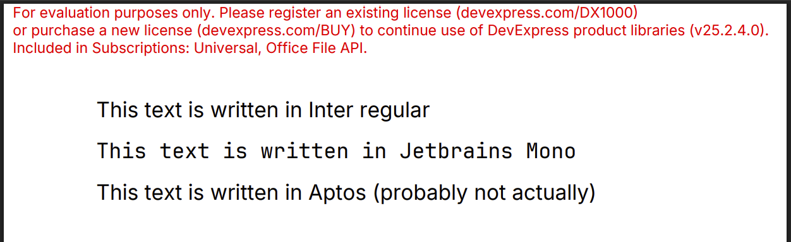

# DevExpress DOCX → PDF in .NET chiseled image (no apt-get)

This repository is a minimal working example showing that **DevExpress Office File API**
can convert a **DOCX to PDF** on Linux using a **.NET chiseled runtime image**
(`mcr.microsoft.com/dotnet/aspnet:10.0-noble-chiseled-composite-extra`)
**without installing native dependencies** in the final image.

The app:

- loads `demo.docx`
- loads a required custom fonts `Inter-Regular.ttf`, `JetBrainsMono-Regular.ttf` via `DXFontRepository`
- exports PDF bytes to **stdout**
- prints diagnostic messages to **stderr**

The goal is to prove a “distroless-ish” production container can work if the correct
native asset strategy is used.

## Why this exists

DevExpress’ Linux installation guide recommends installing packages like `libfontconfig1`
and ICU-related libraries. That’s a problem for chiseled images because they intentionally
do not contain a package manager or shell.

This repo demonstrates a practical alternative: keep the chiseled image, **avoid system
font discovery**, and ship a SkiaSharp native build that does **not** depend on fontconfig.

## Relevant DevExpress documentation

- Use Office File API on Linux  
  <https://docs.devexpress.com/OfficeFileAPI/401441/installation-guide/use-office-file-api-on-linux>

- Load and use custom fonts in Office File API (`DXFontRepository`)  
  <https://docs.devexpress.com/OfficeFileAPI/403512/integration-guide/load-and-use-custom-fonts-in-office-file-api>

- DevExpress Drawing library (Skia vs GDI+, cross-platform)  
  <https://docs.devexpress.com/CoreLibraries/404247/devexpress-drawing-library>

## Key workarounds / what was hard

### SkiaSharp native asset selection (the real blocker)

Using `DevExpress.Drawing.Skia` on Linux pulls SkiaSharp, and the default native asset
(`SkiaSharp.NativeAssets.Linux`) expects `libfontconfig.so.1` to be present.
In a chiseled image, it isn’t, so you get runtime failures like:

`Unable to load shared library 'libSkiaSharp' ... libfontconfig.so.1: cannot open shared object file`

**Workaround:** ship a Skia build that does not depend on fontconfig and prevent the
fontconfig-dependent runtime asset from being used.

```csporoj
<PackageReference Include="SkiaSharp.NativeAssets.Linux.NoDependencies" Version="3.119.2" />

<PackageReference Include="SkiaSharp.NativeAssets.Linux" Version="3.119.2"
                  ExcludeAssets="runtime"
                  PrivateAssets="all" />
```

This forces the runtime to use the NoDependencies native asset rather than the default.

## Running locally

Build and run the container:

```bash
docker build -t dx-office-linux-mwe .
docker run --rm dx-office-linux-mwe > out.pdf
```

`out.pdf` should be a valid PDF (starts with `%PDF-`).

## CI

GitHub Actions builds the Docker image, runs the conversion, validates the PDF header,
and uploads the resulting PDF as an artifact.

## Success: PDF created in chiseled container


